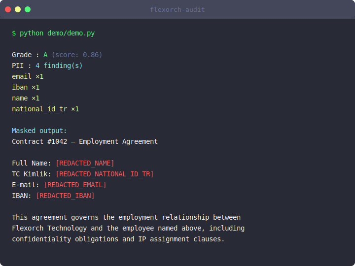

# flexorch-audit

Zero-dependency PII + quality + noise audit for LLM datasets. Answers one question: **is this dataset ready for LLM training?**

- **Quality grade** — A/B/C/D score that signals LLM-readiness at a glance
- **PII detection** — email, phone (TR + E.164), credit card (Luhn), IP, TCKN, IBAN, SSN, label-prefixed names
- **Quality metrics** — completeness, average length, duplicate ratio
- **Noise metrics** — garbage character ratio, encoding health
- **Masking** — redact / replace / token / hash strategies
- **Zero runtime dependencies** — pure Python stdlib, Python 3.10+

```python
from flexorch_audit import audit, mask

text = open("contract.txt").read()  # extract from PDF/DOCX first
result = audit(text, locale="tr")

result.quality_grade   # "A"
result.quality_score   # 0.91  (0.0–1.0 composite)
result.pii_summary     # [{"type": "national_id_tr", "count": 3}, {"type": "email", "count": 1}]

# Full findings and raw metrics — dict access also works (backwards compatible):
result["pii"]          # [{"type": "email", "value": "...", "start": 8, "end": 23}]
result["quality"]      # {"completeness": 1.0, "avg_length": 342, "duplicate_ratio": None}
result["noise"]        # {"garbage_ratio": 0.0, "encoding_ok": True}

clean = mask(text, result["pii"], strategy="redact")
# "Contact: [REDACTED_EMAIL]"
```

## Install

```bash
pip install flexorch-audit
```



## Locale support

| `locale` | Active detectors |
|----------|-----------------|
| `"tr"` (default) | email, iban, credit_card, ip + TCKN, phone_tr, name |
| `"us"` | email, iban, credit_card, ip + SSN, E.164 phone |
| `"eu"` | email, iban, credit_card, ip + E.164 phone |
| `"all"` | All of the above (phone_tr takes precedence over generic phone) |

## PII types

| Type | Description | Locale |
|------|-------------|--------|
| `email` | RFC-5321 address | all |
| `iban` | ISO 13616 IBAN (any country) | all |
| `credit_card` | 16-digit groups, Luhn-validated | all |
| `ip` | IPv4 address | all |
| `phone_tr` | Turkish mobile (+90/0 prefix + 10 digits) | tr |
| `national_id_tr` | TCKN — 11-digit modular arithmetic checksum | tr |
| `name` | Label-prefixed name (e.g. "Adı: Ali Yıldız", "Full Name: Jane Doe") | tr |
| `phone` | E.164 international phone | us, eu |
| `ssn` | US Social Security Number (###-##-####) | us |

## Masking strategies

| Strategy | Example output |
|----------|----------------|
| `redact` (default) | `[REDACTED_EMAIL]` |
| `replace` | `user@example.com` (realistic synthetic) |
| `token` | `<PII_EMAIL_1>` (unique per type) |
| `hash` | `[3d4f9a1b2c8e7f0a]` (SHA-256 first 16 hex chars) |

## Quality grade

The `quality_grade` (A–D) and `quality_score` (0.0–1.0) are composite signals derived from three dimensions:

| Grade | Score | Meaning |
|-------|-------|---------|
| A | ≥ 0.85 | Ready for LLM training or RAG |
| B | ≥ 0.65 | Usable with minor cleanup |
| C | ≥ 0.40 | Needs review before use |
| D | < 0.40 | Not suitable — empty, too short, or high noise |

Score formula: `completeness × (0.4 × noise_score + 0.4 × length_score + 0.2)`
where `length_score = min(char_count / 500, 1.0)` and `noise_score = max(0, 1 − garbage_ratio × 10)`.

## Quality & noise

`duplicate_ratio` is `null` for single-string input. To compute it across a dataset:

```python
texts = [record["text"] for record in dataset]
results = [audit(t) for t in texts]

seen = set()
duplicates = sum(1 for t in texts if t in seen or seen.add(t))
duplicate_ratio = duplicates / len(texts)
```

## Limitations (v0.1)

- Free-standing name detection (without a label prefix) requires NLP/NER — not included.
- `duplicate_ratio` is per-call; aggregate across your dataset manually (see above).
- IPv6 not detected.
- IBAN format-only check; mod-97 validation not performed.

## License

MIT
